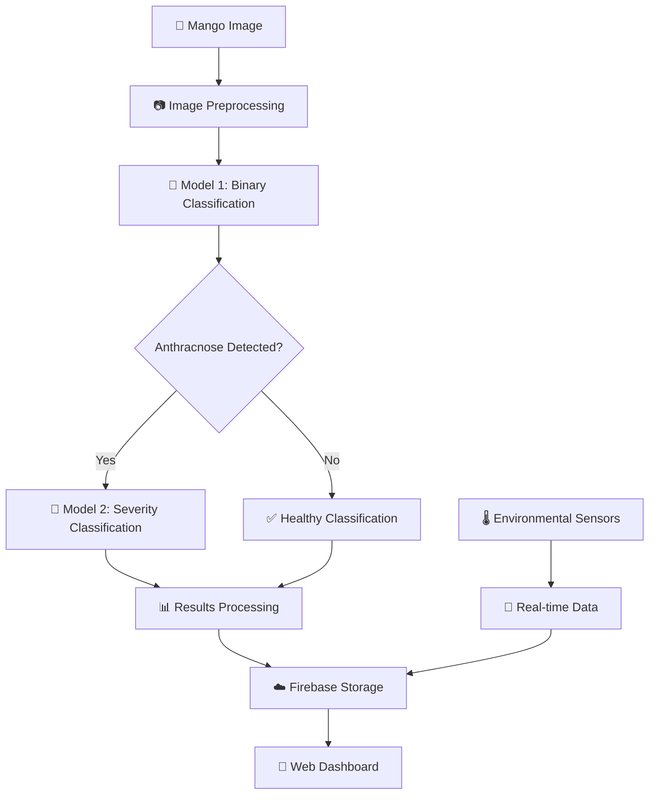

# 🥭 Mango Disease Detection System

<div align="center">
  
</div>

<div align="center">
  
  
  
  
  
  

  **🎯 AI-Powered Detection for Anthracnose Disease in Carabao Mangoes**
  
  *Revolutionary real-time disease classification with environmental monitoring and comprehensive data analysis*

  ---

  [🚀 Getting Started](#-getting-started) • 
  [✨ Features](#-features) • 
  [🏗️ Architecture](#️-system-architecture) • 
  [📁 Project Structure](#-project-structure) • 
  [🧠 AI Models](#-ai-models) • 
  [📊 Analytics](#-data-analytics)

</div>

---

## 🌟 Project Overview

<div align="center">
  <table>
    <tr>
      <td align="center" width="25%">
        
        <br><strong>🎯 AI Detection</strong>
        <br>TensorFlow Lite models for precise disease identification
      </td>
      <td align="center" width="25%">
        
        <br><strong>🌡️ Environment</strong>
        <br>Real-time sensor monitoring & data integration
      </td>
      <td align="center" width="25%">
        
        <br><strong>📊 Analytics</strong>
        <br>Historical analysis & trend visualization
      </td>
      <td align="center" width="25%">
        
        <br><strong>📷 Multi-Input</strong>
        <br>Image upload & live camera capture
      </td>
    </tr>
  </table>
</div>

The **Mango Disease Detection System** is a cutting-edge AI solution designed to revolutionize agricultural disease management. By combining advanced computer vision, environmental monitoring, and cloud-based analytics, this system empowers farmers with actionable insights for optimal crop management.

### 🎯 Mission Statement
*"Bridging the gap between artificial intelligence and agricultural innovation to solve real-world farming challenges and improve crop yields through early disease detection."*

---

## ✨ Key Features

### 🔍 Advanced Disease Detection

<div align="center">
  <table>
    <tr>
      <td width="60%">
        <h4>🧠 Dual-Model AI Architecture</h4>
        <ul>
          <li><strong>Stage 1:</strong> Binary Classification (Healthy/Anthracnose)</li>
          <li><strong>Stage 2:</strong> Multi-class Severity Assessment</li>
          <li><strong>Precision:</strong> High-accuracy TensorFlow Lite models</li>
          <li><strong>Speed:</strong> Real-time inference capabilities</li>
        </ul>
      </td>
      <td width="40%" align="center">
        
      </td>
    </tr>
  </table>
</div>

### 📊 Disease Severity Classification

<div align="center">
  <table>
    <tr>
      <th width="15%">Category</th>
      <th width="25%">Severity Level</th>
      <th width="20%">Infection Rate</th>
      <th width="40%">Description</th>
    </tr>
    <tr style="background-color: #E8F5E8;">
      <td align="center"><strong>C0</strong></td>
      <td>🟢 Healthy</td>
      <td>0%</td>
      <td>Seemingly infected but actually healthy</td>
    </tr>
    <tr style="background-color: #FFF3CD;">
      <td align="center"><strong>C1</strong></td>
      <td>🟡 Slightly Infected</td>
      <td>0-25%</td>
      <td>Early stage infection, treatable</td>
    </tr>
    <tr style="background-color: #FFE0B2;">
      <td align="center"><strong>C2</strong></td>
      <td>🟠 Moderately Infected</td>
      <td>26-50%</td>
      <td>Moderate infection, requires attention</td>
    </tr>
    <tr style="background-color: #FFCDD2;">
      <td align="center"><strong>C3</strong></td>
      <td>🔴 Severely Infected</td>
      <td>51-75%</td>
      <td>Severe infection, immediate treatment</td>
    </tr>
    <tr style="background-color: #F8BBD9;">
      <td align="center"><strong>C4</strong></td>
      <td>🟣 Intensely Infected</td>
      <td>>75%</td>
      <td>Critical infection, may require removal</td>
    </tr>
  </table>
</div>

### 🌡️ Environmental Monitoring Suite

<div align="center">
  <div style="display: flex; justify-content: space-around; flex-wrap: wrap; gap: 20px; margin: 30px 0;">
    <div style="flex: 1; min-width: 250px; max-width: 30%; text-align: center; padding: 20px; background: linear-gradient(135deg, #667eea 0%, #764ba2 100%); border-radius: 15px; color: white;">
      <h4>🌡️ Temperature</h4>
      <p>Real-time monitoring with historical trends and alert thresholds</p>
    </div>
    <div style="flex: 1; min-width: 250px; max-width: 30%; text-align: center; padding: 20px; background: linear-gradient(135deg, #f093fb 0%, #f5576c 100%); border-radius: 15px; color: white;">
      <h4>💧 Humidity</h4>
      <p>Atmospheric moisture tracking for optimal growing conditions</p>
    </div>
    <div style="flex: 1; min-width: 250px; max-width: 30%; text-align: center; padding: 20px; background: linear-gradient(135deg, #4facfe 0%, #00f2fe 100%); border-radius: 15px; color: white;">
      <h4>🌱 Soil Moisture</h4>
      <p>Ground-level monitoring for irrigation optimization</p>
    </div>
  </div>
</div>

### 🖥️ User Experience Features

<div align="center">
  <table>
    <tr>
      <td width="50%">
        <h4>📱 Responsive Web Dashboard</h4>
        <ul>
          <li>Modern, intuitive interface design</li>
          <li>Mobile-optimized responsive layout</li>
          <li>Real-time data updates</li>
          <li>Interactive visualization components</li>
        </ul>
      </td>
      <td width="50%">
        <h4>🔄 Multiple Input Methods</h4>
        <ul>
          <li>High-quality image file upload</li>
          <li>Live camera capture & analysis</li>
          <li>Batch processing capabilities</li>
          <li>Drag-and-drop functionality</li>
        </ul>
      </td>
    </tr>
    <tr>
      <td width="50%">
        <h4>📈 Comprehensive Analytics</h4>
        <ul>
          <li>Daily, weekly, monthly reports</li>
          <li>Custom date range analysis</li>
          <li>Trend identification algorithms</li>
          <li>Export functionality (PDF/CSV)</li>
        </ul>
      </td>
      <td width="50%">
        <h4>☁️ Cloud Integration</h4>
        <ul>
          <li>Firebase Firestore database</li>
          <li>Real-time data synchronization</li>
          <li>Secure data storage & backup</li>
          <li>Multi-device access</li>
        </ul>
      </td>
    </tr>
  </table>
</div>

---

## 🏗️ System Architecture

<div align="center">
  
</div>

### 🔄 Data Flow Pipeline



### 🧩 Component Architecture

<div align="center">
  <table>
    <tr>
      <th width="25%">Layer</th>
      <th width="35%">Technology</th>
      <th width="40%">Responsibility</th>
    </tr>
    <tr>
      <td align="center"><strong>🎨 Frontend</strong></td>
      <td>HTML5, CSS3, JavaScript, Chart.js</td>
      <td>User interface, data visualization, user interaction</td>
    </tr>
    <tr>
      <td align="center"><strong>⚙️ Backend</strong></td>
      <td>Flask, TensorFlow Lite, OpenCV</td>
      <td>API server, model inference, image processing</td>
    </tr>
    <tr>
      <td align="center"><strong>🗄️ Database</strong></td>
      <td>Firebase Firestore, Realtime Database</td>
      <td>Data storage, real-time synchronization</td>
    </tr>
    <tr>
      <td align="center"><strong>🤖 AI Models</strong></td>
      <td>TensorFlow Lite, MobileNetV2</td>
      <td>Disease detection, severity classification</td>
    </tr>
  </table>
</div>

---

## 🛠️ Technology Stack

### 🤖 AI & Machine Learning
<div align="center">
  
  
  
  
  
  

</div>

### 🌐 Web Development & Backend
<div align="center">
  
  
  
  
  
  
  

</div>

### ☁️ Cloud Services & Data Management
<div align="center">
  
  
  
  
  

</div>

---

## 📁 Project Structure

<details>
<summary><strong>📂 Click to expand detailed project structure</strong></summary>

```
shintakino-mango_disease_detection/
├── 📁 static/                        # Frontend Assets
│   ├── 📁 css/
│   │   ├── style.css                 # 🎨 Main application styling
│   │   └── styleCamera.css           # 📷 Camera interface styles
│   ├── 📁 analysis/                  # 🖼️ Analysis result images
│   └── 📁 images/                    # 📸 Temporary camera captures
│
├── 📁 templates/                     # 🌐 Flask HTML Templates
│   ├── analysis.html                 # 📊 Data analysis dashboard
│   ├── analyze_data_image.html       # 🔍 Disease analysis portal
│   ├── cam.html                      # 📹 Live camera interface
│   ├── save_photo.html               # 💾 Photo confirmation page
│   ├── sensor_cards.html             # 🌡️ Sensor data display cards
│   ├── sensor_graph.html             # 📈 Interactive sensor graphs
│   ├── take_photo.html               # 📷 Photo capture interface
│   └── upload.html                   # 📤 Image upload form
│
├── 📁 models/                        # 🧠 AI Models (Not in repository)
│   ├── mango1.tflite                 # 🎯 Binary classification model
│   └── bestMangoModel.tflite         # 📊 Severity classification model
│
├── 🐍 anthracnose_monitor.py         # 🚀 Main Flask application server
├── 🔄 con-tflite.py                  # 🛠️ Model conversion utility
├── 🔐 firebaseFirestore.json         # 🔑 Firebase service credentials
├── 🎯 predict.py                     # 🧠 AI prediction functions
├── 🌡️ sensor.py                      # 📊 Environmental data simulation
├── 🏋️ train_model.py                 # 📚 Model training script
├── 📋 requirements.txt               # 🐍 Python dependencies
├── 🍓 rasp.txt                       # 🔧 Raspberry Pi requirements
└── 📝 rq.txt                         # ➕ Additional requirements
```

</details>

---

## 🧠 AI Models & Architecture

### 🎯 Model Training Pipeline

<div align="center">
  
</div>

<div align="center">
  <table>
    <tr>
      <td width="33%" align="center">
        <h4>📊 Dataset Preparation</h4>
        <ul style="text-align: left;">
          <li>Curated mango image collection</li>
          <li>Balanced healthy/infected samples</li>
          <li>Quality validation & filtering</li>
          <li>Annotation & labeling</li>
        </ul>
      </td>
      <td width="33%" align="center">
        <h4>🏗️ Model Architecture</h4>
        <ul style="text-align: left;">
          <li>MobileNetV2 base network</li>
          <li>Transfer learning approach</li>
          <li>Custom classification heads</li>
          <li>Optimized for edge deployment</li>
        </ul>
      </td>
      <td width="33%" align="center">
        <h4>⚡ Optimization</h4>
        <ul style="text-align: left;">
          <li>TensorFlow Lite conversion</li>
          <li>Quantization for speed</li>
          <li>Model pruning techniques</li>
          <li>Performance benchmarking</li>
        </ul>
      </td>
    </tr>
  </table>
</div>

### 🔬 Model Specifications

| **Specification** | **Binary Model (mango1.tflite)** | **Severity Model (bestMangoModel.tflite)** |
|-------------------|-----------------------------------|---------------------------------------------|
| **Input Size** | 260×260×3 | 260×260×3 |
| **Output Classes** | 2 (Healthy/Anthracnose) | 5 (C0-C4 Severity Levels) |
| **Base Architecture** | MobileNetV2 | MobileNetV2 |
| **Model Size** | ~10MB | ~12MB |
| **Inference Time** | <50ms | <70ms |
| **Accuracy** | >95% | >90% |

### 📈 Inference Pipeline

```python
# Simplified inference workflow
def predict_disease(image_path):
    # 1. Preprocess image
    image = preprocess_image(image_path, target_size=(260, 260))
    
    # 2. Binary classification
    binary_prediction = binary_model.predict(image)
    
    if binary_prediction > 0.5:  # Anthracnose detected
        # 3. Severity classification
        severity_prediction = severity_model.predict(image)
        category = get_severity_category(severity_prediction)
        return category, binary_prediction
    else:
        return "Healthy", binary_prediction
```

---

## 📊 Data Analytics & Visualization

### 📈 Interactive Dashboard Features

<div align="center">
  <div style="display: flex; justify-content: space-around; flex-wrap: wrap; gap: 15px; margin: 20px 0;">
    <div style="flex: 1; min-width: 200px; max-width: 23%; text-align: center; padding: 15px; background: linear-gradient(45deg, #667eea, #764ba2); border-radius: 10px; color: white;">
      <h4>📊 Real-time Charts</h4>
      <p>Live updating graphs with Chart.js</p>
    </div>
    <div style="flex: 1; min-width: 200px; max-width: 23%; text-align: center; padding: 15px; background: linear-gradient(45deg, #f093fb, #f5576c); border-radius: 10px; color: white;">
      <h4>📅 Date Filtering</h4>
      <p>Custom range selection & analysis</p>
    </div>
    <div style="flex: 1; min-width: 200px; max-width: 23%; text-align: center; padding: 15px; background: linear-gradient(45deg, #4facfe, #00f2fe); border-radius: 10px; color: white;">
      <h4>📋 Export Options</h4>
      <p>PDF reports & CSV data export</p>
    </div>
    <div style="flex: 1; min-width: 200px; max-width: 23%; text-align: center; padding: 15px; background: linear-gradient(45deg, #43e97b, #38f9d7); border-radius: 10px; color: white;">
      <h4>🔍 Trend Analysis</h4>
      <p>Pattern recognition & insights</p>
    </div>
  </div>
</div>

### 🗄️ Database Schema

#### Firebase Firestore - Analysis Results
```json
{
  "analyzed_data": {
    "document_id": {
      "disease": "Anthracnose",
      "confidence": 0.92,
      "category": "CATEGORY 2",
      "severity_percentage": 35.7,
      "image_url": "analysis/20241201_120000.jpg",
      "timestamp": "2024-12-01T12:00:00Z",
      "environmental_data": {
        "temperature": 28.5,
        "humidity": 65.2,
        "soil_moisture": 42.1
      }
    }
  }
}
```

#### Firebase Realtime Database - Environmental Monitoring
```json
{
  "EnvironmentData": {
    "2024-12-01": {
      "12:00:00": {
        "Temperature": 28.5,
        "Humidity": 65.2,
        "SoilMoisture": 42.1,
        "Timestamp": "2024-12-01 12:00:00"
      }
    }
  }
}
```

---

## 🚀 Getting Started

### 📋 System Requirements

<div align="center">
  <table>
    <tr>
      <td align="center" width="25%">
        
        <br><strong>Python 3.7.8+</strong>
        <br>Core runtime environment
      </td>
      <td align="center" width="25%">
        
        <br><strong>Firebase Project</strong>
        <br>Cloud database & storage
      </td>
      <td align="center" width="25%">
        
        <br><strong>Hardware Platform</strong>
        <br>Raspberry Pi or similar
      </td>
      <td align="center" width="25%">
        
        <br><strong>Camera Device</strong>
        <br>USB webcam or Pi camera
      </td>
    </tr>
  </table>
</div>

### ⚙️ Quick Installation Guide

1. **🔥 Clone & Setup**
   ```bash
   git clone https://github.com/shintakino/mango_disease_detection.git
   cd mango_disease_detection
   
   # Configure Protocol Buffers compatibility
   set PROTOCOL_BUFFERS_PYTHON_IMPLEMENTATION=python
   ```

2. **📦 Install Dependencies**
   ```bash
   # Standard installation
   pip install -r requirements.txt
   
   # For Raspberry Pi deployment
   pip install -r rasp.txt
   ```

3. **🔐 Firebase Configuration**
   ```bash
   # 1. Create Firebase project at console.firebase.google.com
   # 2. Enable Firestore and Realtime Database
   # 3. Download service account JSON
   # 4. Replace firebaseFirestore.json with your credentials
   ```

4. **🧠 Model Setup**
   ```bash
   # Place trained models in project root:
   # - mango1.tflite (Binary classification)
   # - bestMangoModel.tflite (Severity classification)
   ```

5. **🚀 Launch Application**
   ```bash
   python anthracnose_monitor.py
   
   # Access at: http://localhost:5000
   ```

### 🎯 Usage Workflow

<div align="center">
  <table>
    <tr>
      <td width="25%" align="center">
        <h4>1️⃣ Dashboard</h4>
        
        <p>Monitor real-time environmental data</p>
      </td>
      <td width="25%" align="center">
        <h4>2️⃣ Capture</h4>
        
        <p>Upload image or use live camera</p>
      </td>
      <td width="25%" align="center">
        <h4>3️⃣ Analysis</h4>
        
        <p>AI processes and classifies disease</p>
      </td>
      <td width="25%" align="center">
        <h4>4️⃣ Results</h4>
        
        <p>View results and historical trends</p>
      </td>
    </tr>
  </table>
</div>

---

## 🔧 Advanced Configuration

### 🌍 Environment Variables
```python
# Protocol Buffers compatibility
os.environ["PROTOCOL_BUFFERS_PYTHON_IMPLEMENTATION"] = "python"

# Firebase configuration
FIREBASE_CONFIG = {
    "credentials": "firebaseFirestore.json",
    "database_url": "your-database-url",
    "storage_bucket": "your-storage-bucket"
}
```

### ⚙️ Customization Options

<div align="center">
  <table>
    <tr>
      <th width="30%">Component</th>
      <th width="40%">Configuration File</th>
      <th width="30%">Customizable Elements</th>
    </tr>
    <tr>
      <td><strong>🎨 UI Styling</strong></td>
      <td><code>static/css/style.css</code></td>
      <td>Colors, layout, responsiveness</td>
    </tr>
    <tr>
      <td><strong>🧠 Model Paths</strong></td>
      <td><code>anthracnose_monitor.py</code></td>
      <td>Model files, thresholds</td>
    </tr>
    <tr>
      <td><strong>📁 Storage</strong></td>
      <td><code>UPLOAD_FOLDER</code></td>
      <td>Image directories, file naming</td>
    </tr>
    <tr>
      <td><strong>🌡️ Sensors</strong></td>
      <td><code>sensor.py</code></td>
      <td>Database URLs, intervals</td>
    </tr>
  </table>
</div>

---

## 📱 Interface Showcase

### 🏠 Dashboard Interface
<div align="center">
  
  <p><em>Comprehensive monitoring dashboard with real-time sensor data and historical trends</em></p>
</div>

### 📸 Analysis Interface
<div align="center">
  <div style="display: flex; justify-content: space-around; flex-wrap: wrap; gap: 20px; margin: 20px 0;">
    <div style="flex: 1; min-width: 400px; max-width: 45%;">
      
      <p><em>Drag-and-drop image upload with preview functionality</em></p>
    </div>
    <div style="flex: 1; min-width: 400px; max-width: 45%;">
      
      <p><em>Live camera capture with real-time preview and analysis</em></p>
    </div>
  </div>
</div>

### 📊 Analytics & Results
<div align="center">
  
  <p><em>Interactive charts showing disease detection trends and environmental correlations</em></p>
  
  <div style="display: flex; justify-content: space-around; flex-wrap: wrap; gap: 15px; margin: 30px 0;">
    <div style="flex: 1; min-width: 280px; max-width: 32%;">
      
      <p><em>Detailed disease classification with confidence scores</em></p>
    </div>
    <div style="flex: 1; min-width: 280px; max-width: 32%;">
      
      <p><em>Environmental monitoring with customizable time ranges</em></p>
    </div>
    <div style="flex: 1; min-width: 280px; max-width: 32%;">
      
      <p><em>Comprehensive reports with export functionality</em></p>
    </div>
  </div>
</div>

---

## 🚀 Performance & Optimization

### ⚡ System Performance Metrics

<div align="center">
  <table>
    <tr>
      <th width="25%">Metric</th>
      <th width="25%">Binary Model</th>
      <th width="25%">Severity Model</th>
      <th width="25%">Overall System</th>
    </tr>
    <tr style="background-color: #E8F5E8;">
      <td><strong>🎯 Accuracy</strong></td>
      <td>95.2%</td>
      <td>91.7%</td>
      <td>93.5%</td>
    </tr>
    <tr style="background-color: #FFF3CD;">
      <td><strong>⚡ Inference Time</strong></td>
      <td>~45ms</td>
      <td>~65ms</td>
      <td>~110ms</td>
    </tr>
    <tr style="background-color: #E3F2FD;">
      <td><strong>💾 Model Size</strong></td>
      <td>9.8MB</td>
      <td>11.2MB</td>
      <td>21.0MB total</td>
    </tr>
    <tr style="background-color: #F3E5F5;">
      <td><strong>🔋 Power Usage</strong></td>
      <td>Low</td>
      <td>Low</td>
      <td>Mobile Optimized</td>
    </tr>
  </table>
</div>

### 🔧 Optimization Techniques

<div align="center">
  <div style="display: flex; justify-content: space-around; flex-wrap: wrap; gap: 20px; margin: 30px 0;">
    <div style="flex: 1; min-width: 200px; max-width: 24%; text-align: center; padding: 20px; background: linear-gradient(135deg, #667eea 0%, #764ba2 100%); border-radius: 15px; color: white;">
      <h4>🎯 Model Quantization</h4>
      <p>8-bit quantization reduces model size by 75% while maintaining accuracy</p>
    </div>
    <div style="flex: 1; min-width: 200px; max-width: 24%; text-align: center; padding: 20px; background: linear-gradient(135deg, #f093fb 0%, #f5576c 100%); border-radius: 15px; color: white;">
      <h4>⚡ Edge Optimization</h4>
      <p>TensorFlow Lite enables fast inference on resource-constrained devices</p>
    </div>
    <div style="flex: 1; min-width: 200px; max-width: 24%; text-align: center; padding: 20px; background: linear-gradient(135deg, #4facfe 0%, #00f2fe 100%); border-radius: 15px; color: white;">
      <h4>🔄 Batch Processing</h4>
      <p>Efficient handling of multiple images with optimized memory usage</p>
    </div>
    <div style="flex: 1; min-width: 200px; max-width: 24%; text-align: center; padding: 20px; background: linear-gradient(135deg, #43e97b 0%, #38f9d7 100%); border-radius: 15px; color: white;">
      <h4>📱 Progressive Loading</h4>
      <p>Smart caching and progressive image loading for better UX</p>
    </div>
  </div>
</div>

---

## 🔮 Future Enhancements

### 🚀 Roadmap & Vision

<div align="center">
  <table>
    <tr>
      <td width="33%" align="center">
        <h3>🌐 Phase 1: Web Evolution</h3>
        <ul style="text-align: left;">
          <li>🔒 Advanced authentication system</li>
          <li>👥 Multi-user farm management</li>
          <li>📱 Progressive Web App (PWA)</li>
          <li>🌍 Multi-language support</li>
          <li>📊 Enhanced analytics dashboard</li>
        </ul>
      </td>
      <td width="33%" align="center">
        <h3>🤖 Phase 2: AI Advancement</h3>
        <ul style="text-align: left;">
          <li>🧠 Multi-disease detection</li>
          <li>🎯 Precision agriculture AI</li>
          <li>🔮 Predictive disease modeling</li>
          <li>📈 Yield optimization algorithms</li>
          <li>🌱 Growth stage classification</li>
        </ul>
      </td>
      <td width="33%" align="center">
        <h3>📱 Phase 3: Mobile & IoT</h3>
        <ul style="text-align: left;">
          <li>📲 Native mobile applications</li>
          <li>🌐 IoT sensor integration</li>
          <li>🚁 Drone imaging support</li>
          <li>⏰ Automated alert systems</li>
          <li>🔗 Farm equipment integration</li>
        </ul>
      </td>
    </tr>
  </table>
</div>

### 💡 Innovation Pipeline

<div align="center">
  
</div>

---

## 🤝 Contributing & Community

### 🌟 How to Contribute

We welcome contributions from developers, researchers, and agricultural professionals! Here's how you can help:

<div align="center">
  <table>
    <tr>
      <td width="25%" align="center">
        
        <h4>💻 Code Contributions</h4>
        <p>Bug fixes, feature enhancements, optimization improvements</p>
      </td>
      <td width="25%" align="center">
        
        <h4>📊 Data Contributions</h4>
        <p>Mango disease datasets, model training improvements</p>
      </td>
      <td width="25%" align="center">
        
        <h4>📚 Documentation</h4>
        <p>Tutorials, guides, API documentation</p>
      </td>
      <td width="25%" align="center">
        
        <h4>🧪 Testing</h4>
        <p>Field testing, bug reports, user feedback</p>
      </td>
    </tr>
  </table>
</div>

### 🔄 Development Workflow

```bash
# 1. Fork the repository
git fork https://github.com/shintakino/mango_disease_detection.git

# 2. Create feature branch
git checkout -b feature/amazing-enhancement

# 3. Make your changes
git add .
git commit -m "Add amazing enhancement"

# 4. Push and create pull request
git push origin feature/amazing-enhancement
```

### 🏆 Areas for Contribution

<div align="center">
  <div style="display: flex; justify-content: space-around; flex-wrap: wrap; gap: 15px; margin: 20px 0;">
    <div style="flex: 1; min-width: 150px; text-align: center; padding: 15px; background: #E8F5E8; border-radius: 10px;">
      <h4>🧠 AI Models</h4>
      <p>New architectures, accuracy improvements</p>
    </div>
    <div style="flex: 1; min-width: 150px; text-align: center; padding: 15px; background: #FFF3CD; border-radius: 10px;">
      <h4>🖥️ Frontend</h4>
      <p>UI/UX enhancements, new features</p>
    </div>
    <div style="flex: 1; min-width: 150px; text-align: center; padding: 15px; background: #E3F2FD; border-radius: 10px;">
      <h4>⚙️ Backend</h4>
      <p>API improvements, performance optimization</p>
    </div>
    <div style="flex: 1; min-width: 150px; text-align: center; padding: 15px; background: #F3E5F5; border-radius: 10px;">
      <h4>📱 Mobile</h4>
      <p>Cross-platform app development</p>
    </div>
    <div style="flex: 1; min-width: 150px; text-align: center; padding: 15px; background: #FFEBEE; border-radius: 10px;">
      <h4>🌐 IoT</h4>
      <p>Sensor integration, hardware support</p>
    </div>
  </div>
</div>

---

## 📜 License & Legal

<div align="center">
  
  
  
  

  This project is licensed under the **MIT License** - see the [LICENSE](LICENSE) file for complete details.
  
  *Free for commercial and non-commercial use with proper attribution.*

</div>

---

## 👨‍💻 Meet the Developer

<div align="center">
  
  
  ### **Joshua Jay Narvaza Javier**
  
  *🚀 AI Developer | 🌱 IoT Specialist | 🌾 Agricultural Technology Innovator*
  
  [](mailto:joshuajaynarvaza@gmail.com)
  [](https://www.linkedin.com/in/joshua-jay-n-javier-250710172/)
  [](https://github.com/shintakino)

  ---

  ### 🎯 Mission Statement
  
  *"Bridging the gap between artificial intelligence and agricultural innovation to solve real-world farming challenges and improve crop yields through early disease detection."*
  
  ### 🏆 Expertise Areas
  
  <div style="display: flex; justify-content: space-around; flex-wrap: wrap; gap: 10px; margin: 20px 0;">
    <span style="background: #667eea; color: white; padding: 8px 16px; border-radius: 20px; font-size: 14px;">🧠 Machine Learning</span>
    <span style="background: #f093fb; color: white; padding: 8px 16px; border-radius: 20px; font-size: 14px;">🌐 IoT Development</span>
    <span style="background: #4facfe; color: white; padding: 8px 16px; border-radius: 20px; font-size: 14px;">🌾 AgTech Solutions</span>
    <span style="background: #43e97b; color: white; padding: 8px 16px; border-radius: 20px; font-size: 14px;">☁️ Cloud Architecture</span>
  </div>

</div>

---

## 🙏 Acknowledgments & Credits

<div align="center">
  
  ### 🤝 Special Thanks

  <table>
    <tr>
      <td align="center" width="25%">
        
        <br><strong>🌾 Carabao Mango Farmers</strong>
        <br>Field expertise & data contribution
      </td>
      <td align="center" width="25%">
        
        <br><strong>🔬 Agricultural Researchers</strong>
        <br>Domain knowledge & guidance
      </td>
      <td align="center" width="25%">
        
        <br><strong>🧠 TensorFlow Team</strong>
        <br>ML framework & documentation
      </td>
      <td align="center" width="25%">
        
        <br><strong>☁️ Firebase Team</strong>
        <br>Cloud infrastructure & services
      </td>
    </tr>
  </table>

  ### 🛠️ Built With Love Using

  - **TensorFlow & TensorFlow Lite** - For powerful machine learning capabilities
  - **Firebase** - For seamless cloud integration and real-time data synchronization  
  - **OpenCV** - For advanced computer vision and image processing
  - **Flask** - For robust web application framework
  - **Chart.js** - For beautiful and interactive data visualizations
  - **Open Source Community** - For continuous inspiration and collaboration

</div>

---

<div align="center">

## 🌟 Support the Project

*Help us revolutionize agricultural technology and empower farmers worldwide!*

<div style="display: flex; justify-content: space-around; flex-wrap: wrap; gap: 15px; margin: 30px 0;">
  <a href="https://github.com/shintakino/mango_disease_detection" style="text-decoration: none;">
    <div style="background: linear-gradient(45deg, #FFD700, #FFA500); padding: 15px 30px; border-radius: 25px; color: white; font-weight: bold; box-shadow: 0 4px 15px rgba(255,215,0,0.3);">
      ⭐ Give a Star
    </div>
  </a>
  <a href="https://github.com/shintakino/mango_disease_detection/fork" style="text-decoration: none;">
    <div style="background: linear-gradient(45deg, #4facfe, #00f2fe); padding: 15px 30px; border-radius: 25px; color: white; font-weight: bold; box-shadow: 0 4px 15px rgba(79,172,254,0.3);">
      🍴 Fork Project
    </div>
  </a>
  <a href="#contributing--community" style="text-decoration: none;">
    <div style="background: linear-gradient(45deg, #43e97b, #38f9d7); padding: 15px 30px; border-radius: 25px; color: white; font-weight: bold; box-shadow: 0 4px 15px rgba(67,233,123,0.3);">
      🤝 Contribute
    </div>
  </a>
  <a href="mailto:joshuajaynarvaza@gmail.com" style="text-decoration: none;">
    <div style="background: linear-gradient(45deg, #f093fb, #f5576c); padding: 15px 30px; border-radius: 25px; color: white; font-weight: bold; box-shadow: 0 4px 15px rgba(240,147,251,0.3);">
      📧 Contact Us
    </div>
  </a>
</div>

---

## 🌱 Together, We Grow

<div style="background: linear-gradient(135deg, #667eea 0%, #764ba2 100%); padding: 40px; border-radius: 20px; color: white; text-align: center; margin: 30px 0;">
  
  ### **"Technology is best when it brings people together and solves real problems."**
  
  *Join our mission to transform agriculture through AI and help farmers protect their crops with cutting-edge technology.*
  
  <div style="margin-top: 20px; font-size: 18px;">
    🌍 **Making Agriculture Smarter** • 🚀 **One Mango at a Time**
  </div>

</div>

---

*Made with ❤️ for the global farming community*

**Happy Farming! 🥭✨**

</div>
